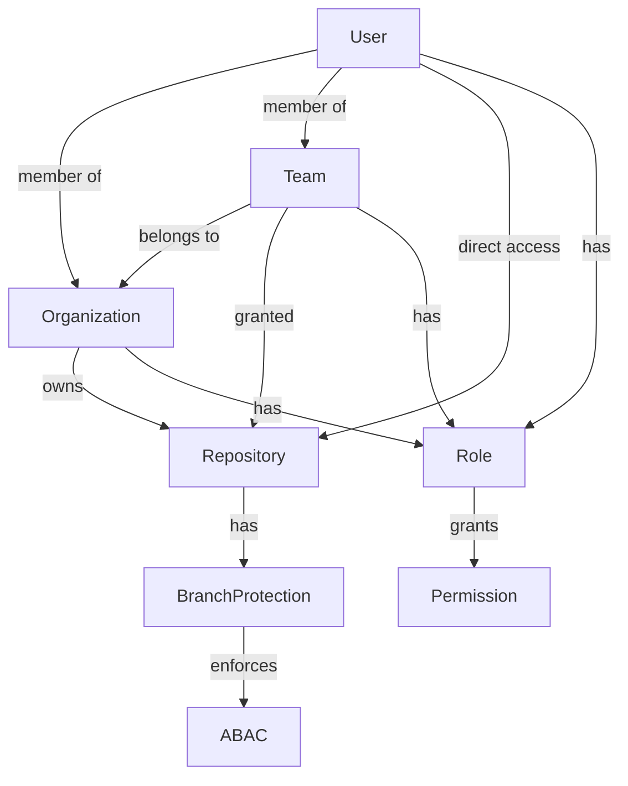
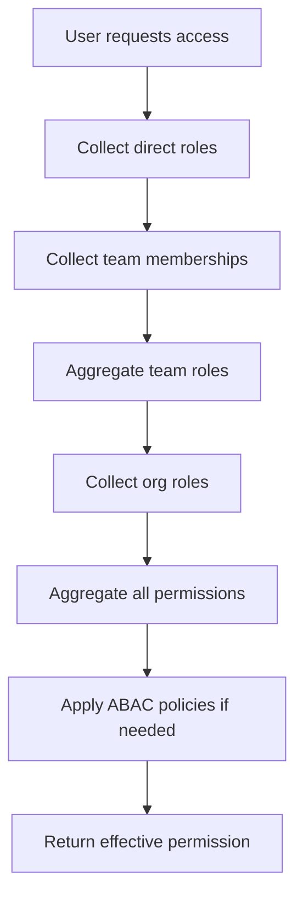

# Rust Design: GitHub-like Permission System (GrpcClient)

## 1. Architecture Overview



## 2. Domain Model

### 2.1 Core Types

```rust
use serde::{Serialize, Deserialize};
use uuid::Uuid;
use chrono::{DateTime, Utc};
use sqlx::FromRow;

#[derive(Debug, Clone, Serialize, Deserialize, FromRow)]
pub struct User {
    pub id: Uuid,
    pub username: String,
    pub email: String,
    pub created_at: DateTime<Utc>,
    pub is_active: bool,
}

#[derive(Debug, Clone, Serialize, Deserialize, FromRow)]
pub struct Organization {
    pub id: Uuid,
    pub name: String,
    pub created_at: DateTime<Utc>,
}

#[derive(Debug, Clone, Serialize, Deserialize, FromRow)]
pub struct Team {
    pub id: Uuid,
    pub org_id: Uuid,
    pub name: String,
    pub parent_team_id: Option<Uuid>,
    pub created_at: DateTime<Utc>,
}

#[derive(Debug, Clone, Serialize, Deserialize, FromRow)]
pub struct Repository {
    pub id: Uuid,
    pub org_id: Uuid,
    pub name: String,
    pub is_private: bool,
    pub created_at: DateTime<Utc>,
}

#[derive(Debug, Clone, Serialize, Deserialize, FromRow)]
pub struct BranchProtection {
    pub id: Uuid,
    pub repo_id: Uuid,
    pub pattern: String,
    pub require_reviews: u8,
    pub require_status_checks: bool,
    pub require_signed_commits: bool,
    pub require_linear_history: bool,
}
```

### 2.2 Roles & Permissions

```rust
#[derive(Debug, Clone, Serialize, Deserialize, PartialEq, Eq, Hash)]
pub enum Role {
    Admin,
    Maintainer,
    Writer,
    Triager,
    Reader,
    Custom(String),
}

#[derive(Debug, Clone, Serialize, Deserialize, PartialEq, Eq, Hash)]
pub enum Permission {
    ManageSettings,
    ManageSecurity,
    ManageBilling,
    ManageTeams,
    ManageRepos,
    Push,
    Pull,
    Merge,
    ManageBranchProtection,
    Custom(String),
}

#[derive(Debug, Clone, Serialize, Deserialize, FromRow)]
pub struct RoleBinding {
    pub id: Uuid,
    pub subject_id: Uuid, // User or Team
    pub subject_type: SubjectType,
    pub resource_id: Uuid, // Org, Team, or Repo
    pub resource_type: ResourceType,
    pub role: Role,
}

#[derive(Debug, Clone, Serialize, Deserialize, PartialEq, Eq, Hash)]
pub enum SubjectType {
    User,
    Team,
}

#[derive(Debug, Clone, Serialize, Deserialize, PartialEq, Eq, Hash)]
pub enum ResourceType {
    Organization,
    Team,
    Repository,
}
```

### 2.3 ABAC Policy

```rust
#[derive(Debug, Clone, Serialize, Deserialize, FromRow)]
pub struct BranchProtectionRule {
    pub id: Uuid,
    pub repo_id: Uuid,
    pub pattern: String,
    pub abac_policy: String, // e.g., JSON logic or CEL expression
}
```

## 3. Permission Evaluation Traits

```rust
pub trait PermissionEvaluator {
    fn has_permission(
        &self,
        user_id: Uuid,
        resource_id: Uuid,
        resource_type: ResourceType,
        permission: &Permission,
        context: Option<&serde_json::Value>, // for ABAC
    ) -> bool;
}

pub trait AbacPolicyEvaluator {
    fn evaluate(&self, policy: &str, context: &serde_json::Value) -> bool;
}
```

## 4. API Layer (Axum + Utoipa)

- All endpoints use JWT authentication and RBAC/ABAC authorization.
- OpenAPI docs generated via utoipa.
- Example endpoint signature:

```rust
#[utoipa::path(
    get,
    path = "/api/repos/{repo_id}/permissions/effective",
    params(
        ("repo_id" = Uuid, Path, description = "Repository ID"),
        ("user_id" = Uuid, Query, description = "User ID")
    ),
    responses(
        (status = 200, description = "Effective permissions", body = [Permission])
    )
)]
async fn get_effective_permissions(
    State(pool): State<PgPool>,
    Path(repo_id): Path<Uuid>,
    Query(user_id): Query<Uuid>,
) -> impl IntoResponse { /* ... */ }
```

## 5. Observability & Configuration

- Use `tracing` for structured logging.
- Use YAML for configuration, validated at startup.
- Expose `/health` and `/metrics` endpoints.

## 6. Error Handling

- Use `thiserror` for library crates, `anyhow` for binaries.
- Centralized error definitions in `errors.rs`.

## 7. Mermaid: Permission Aggregation Flow



## 8. Extensibility

- All core types use strong typing and derive macros for easy extension.
- Custom roles and ABAC policies are supported via enums and string-based policies.

## 9. Testing

- Use `#[cfg(test)]` for unit tests in each module.
- Use `sqlx::test` for DB integration tests.
- All code must pass `cargo test` and `cargo clippy`.
